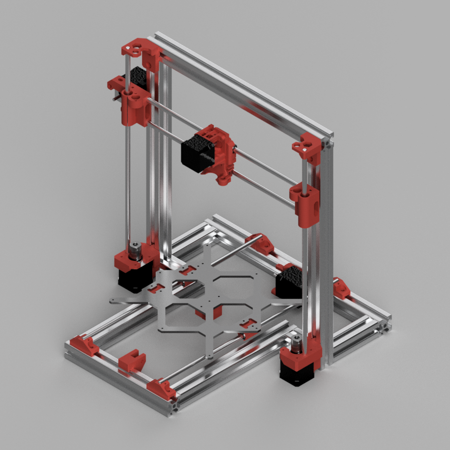

# 3030 Prusa i3 MK3S Mod

This mod is a combination of the [3030 Haribo Edition](https://github.com/PrusaMK2Users/3030_Haribo_Edition) and the [Original Prusa i3 MK3S](https://github.com/prusa3d/Original-Prusa-i3). The parts from the `3030 Haribo Edition` are used for the y-axis and the motor mounts and the rod holders for the z-axis. The rest of the part are from the `Original Prusa i3 MK3S`.

## 3030 Aluminum Extrusion

- 2664 mm total aluminum extrusion.
- 14 angle connectors.
- 44 t-nuts.
- 1 x 850 mm and 1 x 650 mm belt.

|Quantity|Length|
|-       |-     |
|2       |390   |
|2       |99    |
|2       |261   |
|2       |50    |
|2       |417   |
|1       |230   |
